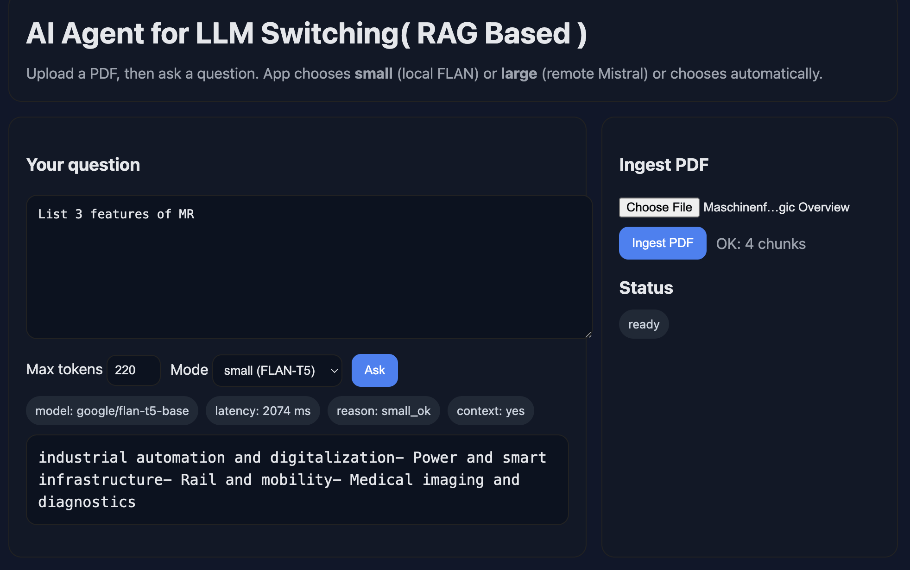

# AI Agent for RAG + LLM Switching

This project is a **Retrieval-Augmented Generation (RAG)** system powered by **LangChain** and **Hugging Face**, with an *AI agent* that automatically switches between a **small local model** (fast, lightweight) and a **large remote model** (accurate, powerful).  

The goal is simple: **reliable answers with the right balance of speed, cost, and quality.**


<p align="center">
  
  
</p>

---

## ✨ Key Features

- **RAG pipeline:** load PDFs → split → embed → store in vector DB → retrieve best context → answer.  
- **Smart LLM router:** automatically decides whether to use *small* or *large* model.  
- **LangChain integration:** document loaders, text splitters, and retrievers.  
- **Hugging Face models:** embeddings + inference endpoints.  
- **FastAPI app:** clean UI + API for ingestion and Q&A.  

---

## 🚀 Quick Start

1. **Clone and setup**
   ```bash
   git clone https://github.com/NandakrishnanR/AI_Agent_LLM_Switching.git
   cd AI_Agent_LLM_Switching
   python3 -m venv .venv
   source .venv/bin/activate
   cp .env.example .env

2. **Install**
pip install -r requirements.txt
3. **Run**
uvicorn app:app --reload     ....#App runs on http://127.0.0.1:8000
⸻

## 🔍 How It Works
	1.	Upload a PDF → chunks are created + embeddings stored in vector DB.
	2.	Ask a question → relevant chunks are retrieved.
	3.	Router decides:
	•	Long/complex question → large model
	•	Simple/short question → small model
	•	No context found → large model
	4.	Response returned with reasoning + latency info.

⸻

## 📈 Scaling the System
	•	Move vector DB from local Chroma to Qdrant Cloud / Pinecone.
	•	Use stronger embeddings (e.g. bge-base or bge-large).
	•	Add hybrid retrieval (dense + BM25).
	•	Enable caching with Redis to save costs.
	•	Deploy via Docker on Railway / Render / GCP Cloud Run.

⸻

## 🛡️ Security
	•	.env is ignored in Git to protect tokens.
	•	Secrets managed via GitHub Actions / Secret Manager.
	•	Push protection is enabled to block accidental leaks.

⸻

 ## 📜 License

Apache-2.0
